# Reactive Programming Diagrams

## Diagram 1: Blocking vs Non-blocking I/O

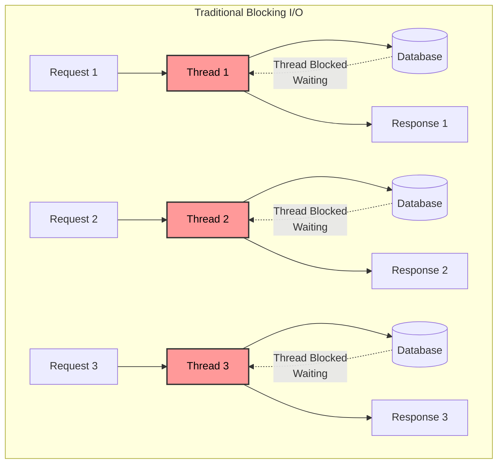

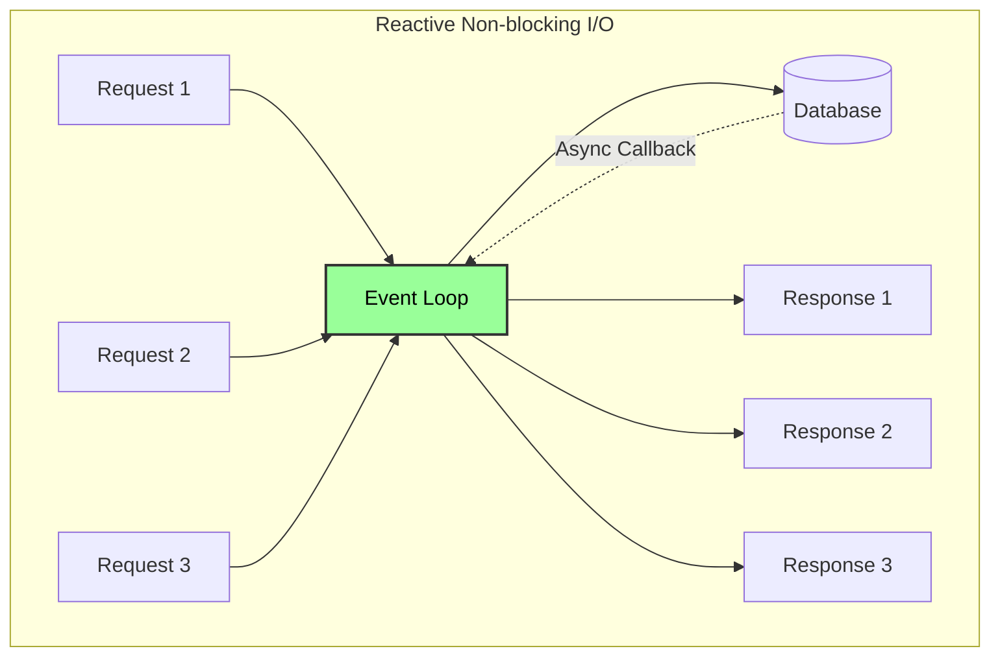

## Diagram 2: Mono and Flux Publishers

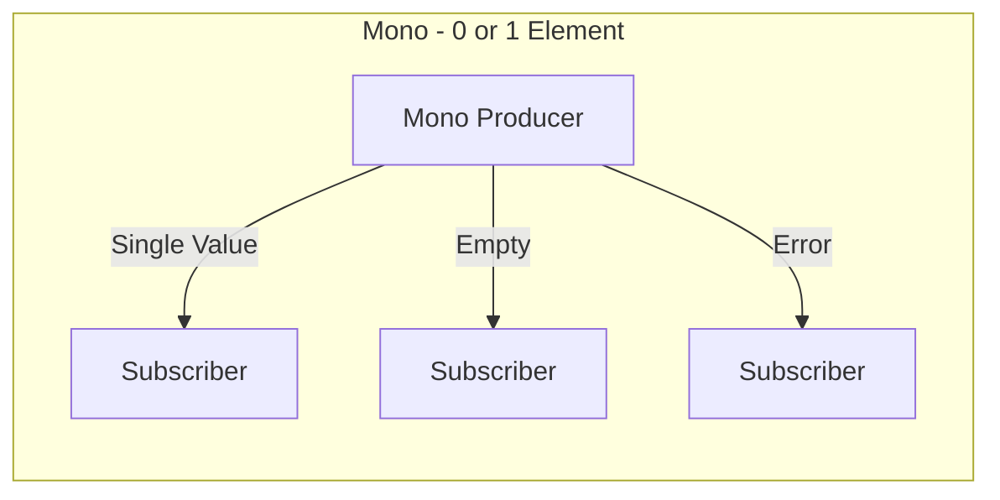

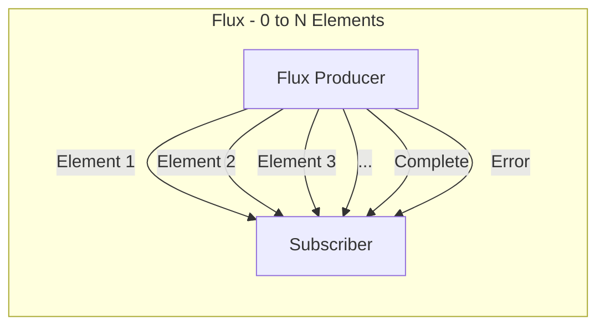

## Diagram 3: Reactive Stream Flow

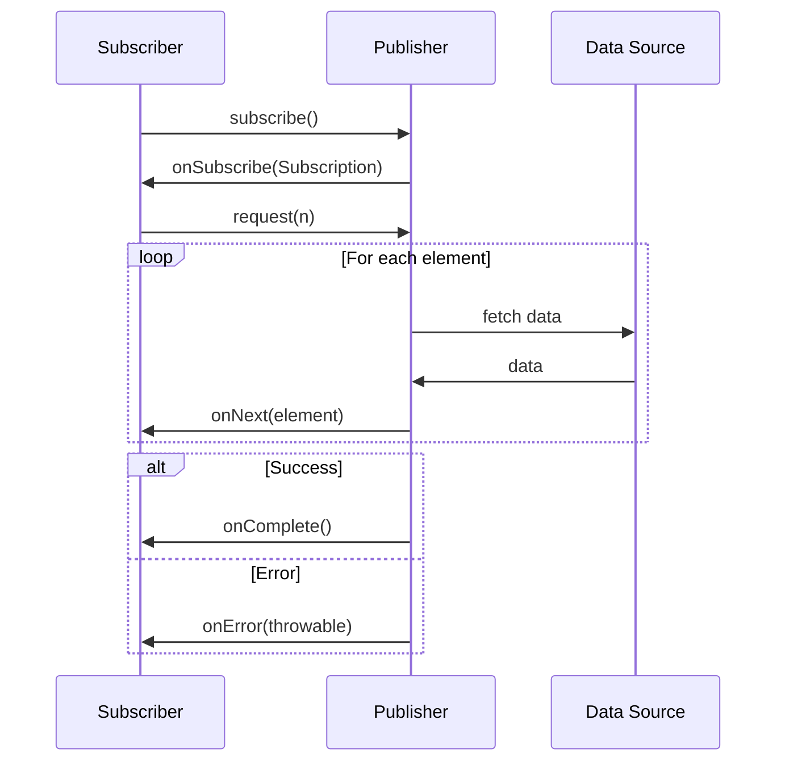

## Diagram 4: Backpressure Strategies

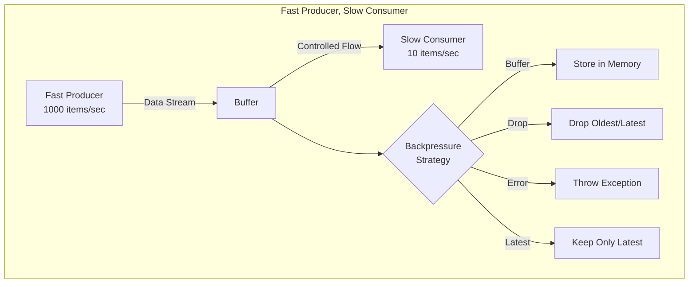

## Diagram 5: Operators Pipeline

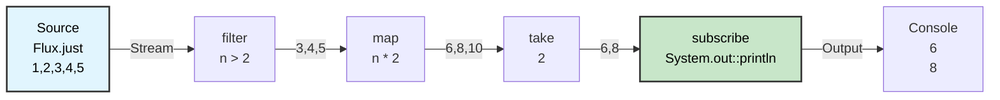

## Diagram 6: Combining Reactive Streams

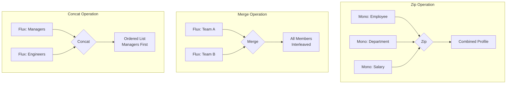

## Diagram 7: Error Handling Strategies

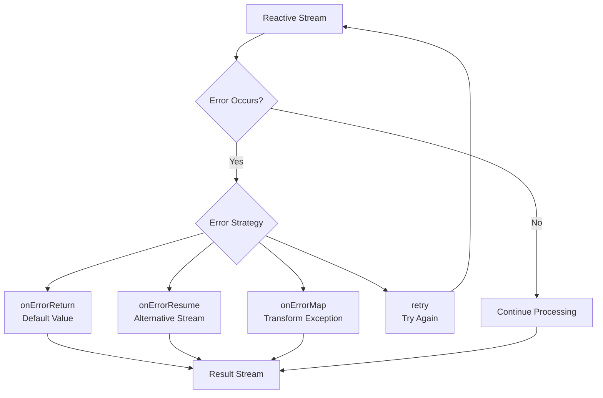

## Diagram 8: Circuit Breaker Pattern (from Microservices)

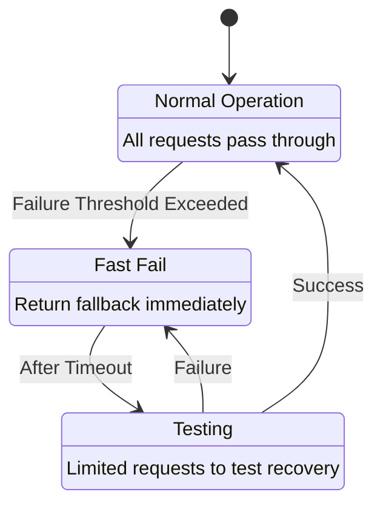

## Diagram 9: Hot vs Cold Publishers

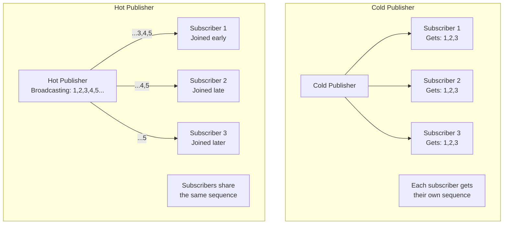

## Diagram 10: Reactive Event Stream Architecture

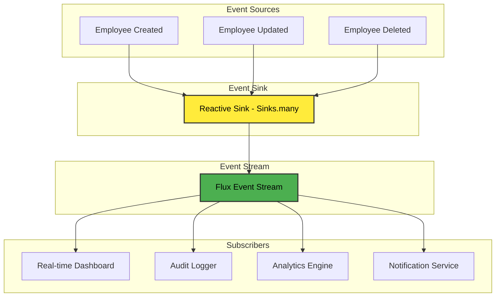

## Usage in Video

These diagrams can be shown during the screen share portion to visualize:
1. **Diagram 1**: When explaining blocking vs non-blocking (Part 1)
2. **Diagram 2**: When introducing Mono and Flux (Part 2)
3. **Diagram 3**: When showing the subscription model
4. **Diagram 5**: When demonstrating operator chaining
5. **Diagram 6**: When showing the combine demo endpoint
6. **Diagram 7**: When demonstrating error handling
7. **Diagram 4**: When explaining backpressure

The diagrams help students visualize the abstract concepts of reactive programming and understand the flow of data through reactive streams.