# Cryptography Concept Diagrams for Topic 23

This file contains Mermaid diagrams to illustrate key cryptographic concepts for the Java Cryptographic APIs video.

## 1. Public-Private Key Pair Relationship

```mermaid
%%{init: {'theme':'dark', 'themeVariables': { 'fontSize': '16px', 'primaryColor': '#ffffff', 'primaryTextColor': '#ffffff', 'primaryBorderColor': '#ffffff', 'lineColor': '#ffffff'}, 'flowchart': {'htmlLabels': true, 'curve': 'basis'}}}%%
graph TB
    KG[Key Generator] --> |generates| KP[Key Pair]
    KP --> PUB[Public Key 🔓]
    KP --> PRIV[Private Key 🔐]
    
    PUB --> |can be shared| WORLD[Anyone]
    PRIV --> |must be kept secret| OWNER[Key Owner Only]
    
    style PUB fill:#2E8B57,color:#FFFFFF,stroke:#FFFFFF,stroke:#FFFFFF
    style PRIV fill:#DC143C,color:#FFFFFF,stroke:#FFFFFF,stroke:#FFFFFF
    style OWNER fill:#DC143C,color:#FFFFFF,stroke:#FFFFFF,stroke:#FFFFFF
    style WORLD fill:#2E8B57,color:#FFFFFF,stroke:#FFFFFF,stroke:#FFFFFF
```

## 2. Digital Signature Process

```mermaid
%%{init: {'theme':'dark', 'themeVariables': { 'fontSize': '16px', 'primaryColor': '#ffffff', 'primaryTextColor': '#ffffff', 'primaryBorderColor': '#ffffff', 'lineColor': '#ffffff'}, 'sequence': {'actorFontSize': 16, 'messageFontSize': 14}}}%%
sequenceDiagram
    participant Alice as Alice (Sender)
    participant Bob as Bob (Receiver)
    
    Note over Alice: Has document to sign
    Alice->>Alice: Hash document with SHA-256
    Alice->>Alice: Encrypt hash with Private Key 🔐
    Alice->>Bob: Send: Document + Digital Signature
    
    Note over Bob: Wants to verify signature
    Bob->>Bob: Hash received document with SHA-256
    Bob->>Bob: Decrypt signature with Alice's Public Key 🔓
    Bob->>Bob: Compare both hashes
    
    alt Hashes match
        Bob->>Bob: ✅ Signature valid - document authentic
    else Hashes don't match
        Bob->>Bob: ❌ Signature invalid - document tampered
    end
```

## 3. Encryption vs Digital Signatures

```mermaid
%%{init: {'theme':'dark', 'themeVariables': { 'fontSize': '16px', 'primaryColor': '#ffffff', 'primaryTextColor': '#ffffff', 'primaryBorderColor': '#ffffff', 'lineColor': '#ffffff'}, 'flowchart': {'htmlLabels': true}}}%%
graph LR
    subgraph ENCRYPTION["🔒 ENCRYPTION (Confidentiality)"]
        E1[Message] --> E2[Encrypt with Recipient's PUBLIC Key 🔓]
        E2 --> E3[Encrypted Message]
        E3 --> E4[Decrypt with Recipient's PRIVATE Key 🔐]
        E4 --> E5[Original Message]
    end
    
    subgraph SIGNATURE["✍️ DIGITAL SIGNATURE (Authentication)"]
        S1[Message] --> S2[Hash Message]
        S2 --> S3[Sign hash with Sender's PRIVATE Key 🔐]
        S3 --> S4[Digital Signature]
        S4 --> S5[Verify with Sender's PUBLIC Key 🔓]
        S5 --> S6[Signature Valid ✅]
    end
    
    style ENCRYPTION fill:#1E3A8A,color:#FFFFFF,stroke:#FFFFFF,stroke:#FFFFFF
    style SIGNATURE fill:#7C3AED,color:#FFFFFF,stroke:#FFFFFF,stroke:#FFFFFF
```

## 4. AES-GCM Symmetric Encryption Flow

## 5. Password Hashing with PBKDF2

```mermaid
%%{init: {'theme':'dark', 'themeVariables': { 'fontSize': '16px', 'primaryColor': '#ffffff', 'primaryTextColor': '#ffffff', 'primaryBorderColor': '#ffffff', 'lineColor': '#ffffff'}, 'flowchart': {'htmlLabels': true}}}%%
graph TD
    PASS[User Password] --> PBKDF2[PBKDF2 Function]
    SALT[Random Salt] --> PBKDF2
    ITER[100,000 Iterations] --> PBKDF2
    
    PBKDF2 --> HASH[Password Hash]
    SALT --> STORE[Store in Database]
    HASH --> STORE
    
    subgraph VERIFY["Password Verification"]
        INPUT[User Input] --> PBKDF2V[PBKDF2 with stored salt]
        STORED_SALT[Stored Salt] --> PBKDF2V
        ITER --> PBKDF2V
        PBKDF2V --> NEW_HASH[Computed Hash]
        NEW_HASH --> COMPARE{Compare Hashes}
        STORED_HASH[Stored Hash] --> COMPARE
        COMPARE --> |Match| SUCCESS[✅ Login Success]
        COMPARE --> |No Match| FAIL[❌ Login Failed]
    end
    
    style PASS fill:#D97706,color:#FFFFFF,stroke:#FFFFFF
    style SALT fill:#0284C7,color:#FFFFFF,stroke:#FFFFFF
    style SUCCESS fill:#059669,color:#FFFFFF,stroke:#FFFFFF
    style FAIL fill:#DC2626,color:#FFFFFF,stroke:#FFFFFF
```

## 6. Virtual Threads Concurrent Cryptography

## 7. Sealed Interface Error Handling

```mermaid
%%{init: {'theme':'dark', 'themeVariables': { 'fontSize': '16px', 'primaryColor': '#ffffff', 'primaryTextColor': '#ffffff', 'primaryBorderColor': '#ffffff', 'lineColor': '#ffffff'}, 'flowchart': {'htmlLabels': true}}}%%
graph TD
    CRYPTO[Cryptographic Operation] --> RESULT{CryptoResult<T>}
    
    RESULT --> |Success Path| SUCCESS["Success<T>(value)"]
    RESULT --> |Error Path| ERROR["Error<T>(message)"]
    
    SUCCESS --> PATTERN[Pattern Matching Switch]
    ERROR --> PATTERN
    
    PATTERN --> |case Success| HANDLE_SUCCESS["✅ Use encrypted value<br/>Log success<br/>Continue processing"]
    PATTERN --> |case Error| HANDLE_ERROR["❌ Log error message<br/>Return error response<br/>Don't expose internals"]
    
    style SUCCESS fill:#059669,color:#FFFFFF,stroke:#FFFFFF
    style ERROR fill:#DC2626,color:#FFFFFF,stroke:#FFFFFF
    style HANDLE_SUCCESS fill:#16A34A,color:#FFFFFF,stroke:#FFFFFF
    style HANDLE_ERROR fill:#B91C1C,color:#FFFFFF,stroke:#FFFFFF
```

## 8. Digital Certificate Structure and Usage

```mermaid
%%{init: {'theme':'dark', 'themeVariables': { 'fontSize': '16px', 'primaryColor': '#ffffff', 'primaryTextColor': '#ffffff', 'primaryBorderColor': '#ffffff', 'lineColor': '#ffffff'}, 'flowchart': {'htmlLabels': true}}}%%
graph TB
    subgraph CERT_CONTENT["📜 Digital Certificate Contents"]
        SUBJECT[Subject: alice.company.com]
        PUB_KEY[Alice's Public Key 🔓]
        ISSUER[Issued by: TrustedCA]
        VALIDITY[Valid: 2024-01-01 to 2025-01-01]
        SERIAL[Serial Number: 12345]
        EXTENSIONS[Extensions: Key Usage, etc.]
    end
    
    subgraph CA_PROCESS["🏛️ Certificate Authority (CA) Process"]
        CA_PRIV[CA's Private Key 🔐]
        HASH_CERT[Hash Certificate Contents]
        SIGN_HASH[Sign Hash with CA Private Key]
        CA_SIGNATURE[CA Digital Signature]
    end
    
    CERT_CONTENT --> HASH_CERT
    CA_PRIV --> SIGN_HASH
    HASH_CERT --> SIGN_HASH
    SIGN_HASH --> CA_SIGNATURE
    
    subgraph FINAL_CERT["📋 Complete Certificate"]
        CERT_DATA[Certificate Data]
        CERT_SIG[CA Signature]
    end
    
    CERT_CONTENT --> CERT_DATA
    CA_SIGNATURE --> CERT_SIG
    
    subgraph VERIFICATION["🔍 Certificate Verification Process"]
        CA_PUB[CA's Public Key 🔓]
        VERIFY_SIG[Verify CA Signature]
        CHECK_VALIDITY[Check Expiration]
        CHECK_TRUST[Check CA Trust Chain]
        TRUSTED{Certificate Trusted?}
    end
    
    FINAL_CERT --> VERIFY_SIG
    CA_PUB --> VERIFY_SIG
    VERIFY_SIG --> CHECK_VALIDITY
    CHECK_VALIDITY --> CHECK_TRUST
    CHECK_TRUST --> TRUSTED
    
    TRUSTED --> |Yes| TRUST_KEY[✅ Trust Alice's Public Key]
    TRUSTED --> |No| REJECT_KEY[❌ Reject Certificate]
    
    style CERT_CONTENT fill:#1E40AF,color:#FFFFFF,stroke:#FFFFFF
    style CA_PROCESS fill:#7C3AED,color:#FFFFFF,stroke:#FFFFFF
    style FINAL_CERT fill:#059669,color:#FFFFFF,stroke:#FFFFFF
    style VERIFICATION fill:#D97706,color:#FFFFFF,stroke:#FFFFFF
    style TRUST_KEY fill:#16A34A,color:#FFFFFF,stroke:#FFFFFF
    style REJECT_KEY fill:#DC2626,color:#FFFFFF,stroke:#FFFFFF
```

## 9. Certificate Trust Chain (Root CA to End User)

```mermaid
%%{init: {'theme':'dark', 'themeVariables': { 'fontSize': '16px', 'primaryColor': '#ffffff', 'primaryTextColor': '#ffffff', 'primaryBorderColor': '#ffffff', 'lineColor': '#ffffff'}, 'flowchart': {'htmlLabels': true}}}%%
graph TD
    ROOT[Root CA 👑<br/>Self-signed<br/>Built into browsers/OS]
    
    ROOT --> |signs| INTERMEDIATE[Intermediate CA 🏢<br/>Certificate signed by Root CA]
    
    INTERMEDIATE --> |signs| SERVER[Server Certificate 🖥️<br/>alice.company.com<br/>Signed by Intermediate CA]
    
    subgraph VALIDATION["🔍 Trust Chain Validation"]
        V1[1. Verify Server Cert with Intermediate CA Public Key]
        V2[2. Verify Intermediate Cert with Root CA Public Key]
        V3[3. Verify Root CA is trusted by system]
        
        V1 --> V2
        V2 --> V3
        V3 --> RESULT{All Valid?}
    end
    
    SERVER --> V1
    
    RESULT --> |Yes| SECURE[🔒 Establish Secure Connection]
    RESULT --> |No| WARNING[⚠️ Certificate Error Warning]
    
    style ROOT fill:#B91C1C,color:#FFFFFF,stroke:#FFFFFF
    style INTERMEDIATE fill:#D97706,color:#FFFFFF,stroke:#FFFFFF
    style SERVER fill:#059669,color:#FFFFFF,stroke:#FFFFFF
    style VALIDATION fill:#1E40AF,color:#FFFFFF,stroke:#FFFFFF
    style SECURE fill:#16A34A,color:#FFFFFF,stroke:#FFFFFF
    style WARNING fill:#DC2626,color:#FFFFFF,stroke:#FFFFFF
```

## 10. Complete Security Architecture

```mermaid
%%{init: {'theme':'dark', 'themeVariables': { 'fontSize': '16px', 'primaryColor': '#ffffff', 'primaryTextColor': '#ffffff', 'primaryBorderColor': '#ffffff', 'lineColor': '#ffffff'}, 'flowchart': {'htmlLabels': true}}}%%
graph TB
    subgraph INPUT["Input Layer"]
        USER[User Input] --> VALIDATE[Input Validation]
        VALIDATE --> |Clean| BUSINESS[Business Logic]
        VALIDATE --> |Malicious| REJECT[❌ Reject Request]
    end
    
    subgraph CRYPTO["Cryptography Layer"]
        BUSINESS --> ENCRYPT[AES-GCM Encryption]
        BUSINESS --> HASH[PBKDF2 Hashing]
        BUSINESS --> SIGN[RSA Digital Signature]
        
        ENCRYPT --> |Sealed Result| HANDLE1[Pattern Match Result]
        HASH --> |Sealed Result| HANDLE2[Pattern Match Result]
        SIGN --> |Sealed Result| HANDLE3[Pattern Match Result]
    end
    
    subgraph STORAGE["Storage Layer"]
        HANDLE1 --> |Success| DB[(Secure Database)]
        HANDLE2 --> |Success| DB
        HANDLE3 --> |Success| DB
        
        HANDLE1 --> |Error| LOG[Error Logging]
        HANDLE2 --> |Error| LOG
        HANDLE3 --> |Error| LOG
    end
    
    style INPUT fill:#1E40AF,color:#FFFFFF,stroke:#FFFFFF
    style CRYPTO fill:#7C3AED,color:#FFFFFF,stroke:#FFFFFF
    style STORAGE fill:#059669,color:#FFFFFF,stroke:#FFFFFF
    style REJECT fill:#DC2626,color:#FFFFFF,stroke:#FFFFFF
    style LOG fill:#D97706,color:#FFFFFF,stroke:#FFFFFF
```

## Usage Instructions

These diagrams can be:
1. **Copied into presentation software** - Render each Mermaid diagram and screenshot for slides
2. **Used in documentation** - GitHub and many tools render Mermaid automatically
3. **Referenced during screenshare** - Open this file and show diagrams while explaining concepts
4. **Included in course materials** - Students can refer to these visual explanations

Each diagram focuses on a specific concept that supports the Java 21 cryptography implementation shown in the code examples.