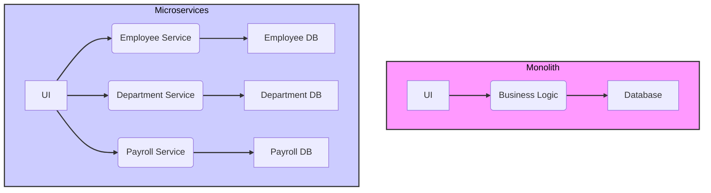
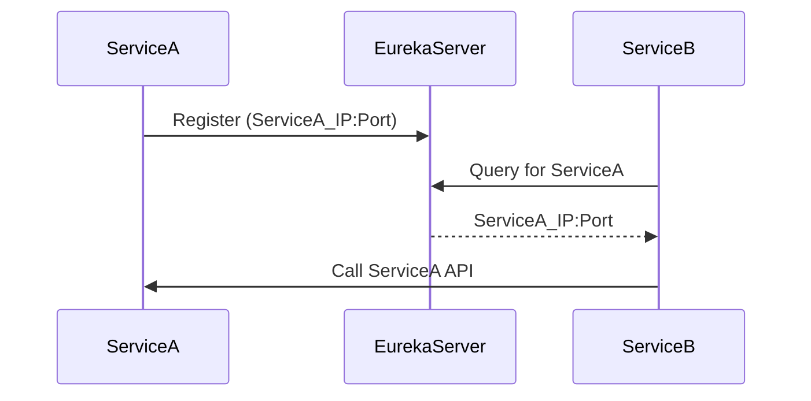
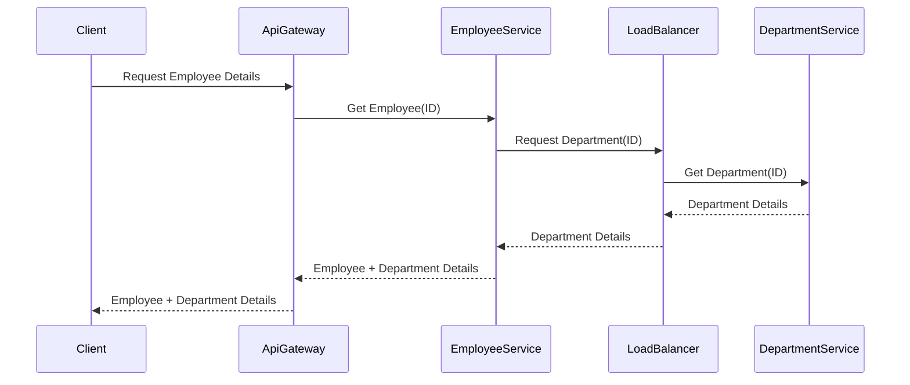
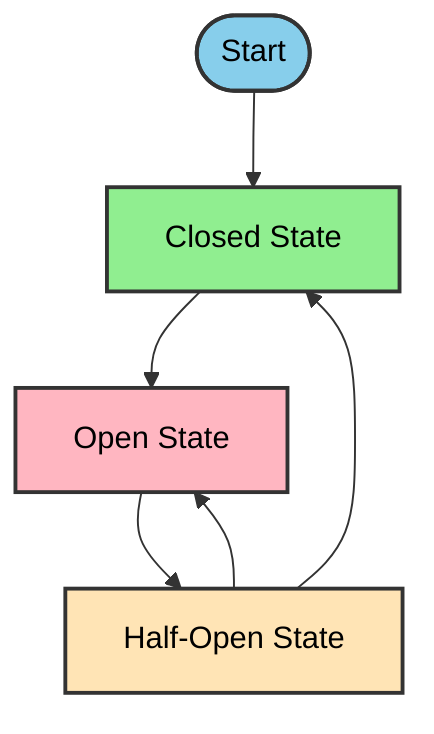
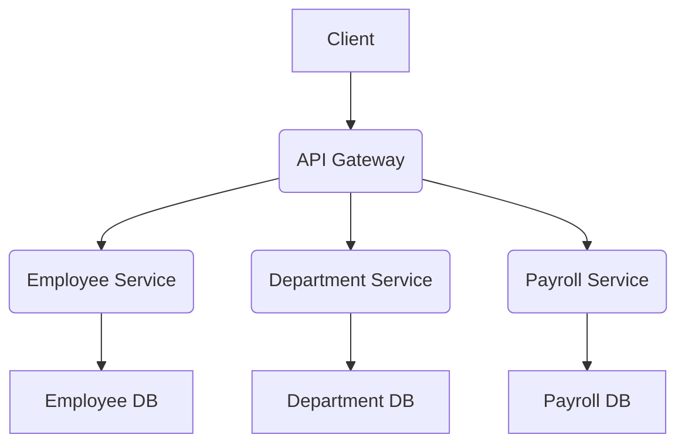

## Microservices Diagrams

---

### 1. Monolith vs. Microservices

---

### 2. Service Discovery Flow

---

### 3. Inter-Service Communication

---

### 4. Circuit Breaker States

---

### 5. API Gateway Routing

