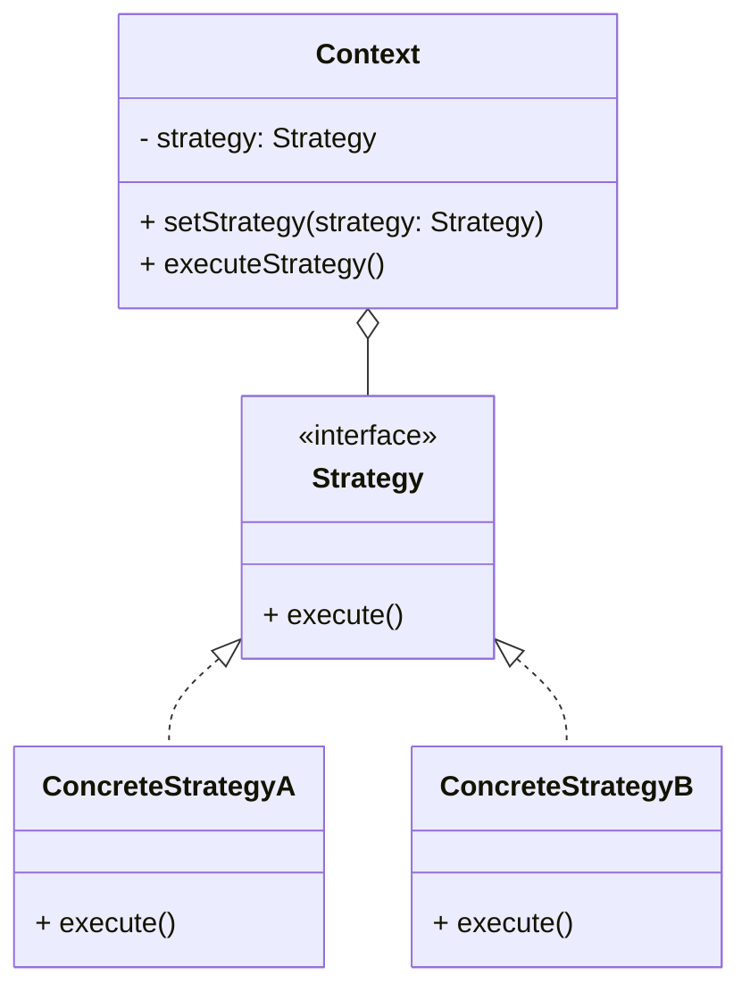

---
layout: cover
--- 

# The Strategy Pattern

<div class="pt-12">
  <span class="px-2 py-1 rounded">
    Goal 14: Apply the Strategy pattern to encapsulate algorithms and make them interchangeable.
  </span>
</div>

---
layout: section
---

# What is the Strategy Pattern?

<v-clicks>

- A **behavioral** design pattern.
- It allows you to define a family of **algorithms**, put each of them into a separate class, and make their objects **interchangeable**.
- It lets the algorithm vary independently from the clients that use it.
- It is one of the original Gang of Four design patterns and is extremely common.

</v-clicks>

<div class="mt-8">
<v-click>

**Key Idea:** Instead of implementing a single algorithm directly, code receives runtime instructions as to which in a family of algorithms to use.

</v-click>
</div>

---

# Core Components of the Strategy Pattern

<v-clicks>

1.  **The `Strategy` Interface:** This is the common interface for all the different algorithms. It declares the method that the `Context` will call.

2.  **Concrete `Strategy` Classes:** These are the individual classes that implement the `Strategy` interface, each providing a different algorithm.

3.  **The `Context` Class:** This is the class that needs the algorithm. It holds a reference to a `Strategy` object and delegates the work to it. The `Context` is not aware of the concrete type of the strategy.

</v-clicks>

---

# UML Diagram



---

# Code Demo: `SalaryCalculator.java`

Let's look at a payroll system that calculates salaries differently for hourly, salaried, and commissioned employees.

**(Show `design-patterns/src/main/java/SalaryCalculator.java`)**

**1. The `Strategy` Interface:**

```java
public interface SalaryCalculationStrategy {
    double calculatePay(StrategyEmployee employee, int hoursWorked);
}
```

**2. The Concrete `Strategy` Classes:**

```java
// For hourly employees
public class HourlyRateStrategy implements SalaryCalculationStrategy { ... }

// For salaried employees
public class SalariedRateStrategy implements SalaryCalculationStrategy { ... }

// For commissioned employees
public class CommissionRateStrategy implements SalaryCalculationStrategy { ... }
```

---

# Code Demo: The `Context`

**3. The `Context` Class:**

The `PayrollProcessor` is our context. It has a `SalaryCalculationStrategy` and a method to process the payroll.

```java
// Context class using the strategy
public class PayrollProcessor {
    private SalaryCalculationStrategy calculationStrategy;

    // The strategy can be set at runtime
    public void setCalculationStrategy(SalaryCalculationStrategy strategy) {
        this.calculationStrategy = strategy;
    }

    public double processPayroll(StrategyEmployee employee, int hoursWorked) {
        if (calculationStrategy == null) {
            throw new IllegalStateException("Calculation strategy not set");
        }
        // Delegate the calculation to the strategy object
        return calculationStrategy.calculatePay(employee, hoursWorked);
    }
}
```

---

# Switching Strategies at Runtime

The real power of the Strategy pattern is that you can change the context's behavior by swapping out its strategy object.

```java
// From StrategyPatternDemo.java
PayrollProcessor processor = new PayrollProcessor();
StrategyEmployee employee = new StrategyEmployee(...);

// Use the hourly strategy
processor.setCalculationStrategy(new HourlyRateStrategy(25.0));
processor.processPayroll(employee, 40); // Calculates based on hourly rate

// Now, switch to the salaried strategy for the same employee
processor.setCalculationStrategy(new SalariedRateStrategy(80000));
processor.processPayroll(employee, 40); // Calculates based on annual salary
```

---
layout: section
---

# Key Takeaways

<v-clicks>

- The Strategy pattern is a powerful way to handle variations in algorithms.
- It encapsulates each algorithm into its own class.
- It allows you to change the algorithm used by an object at runtime.
- This leads to more flexible, maintainable, and testable code by following the Open/Closed Principle.

</v-clicks>
