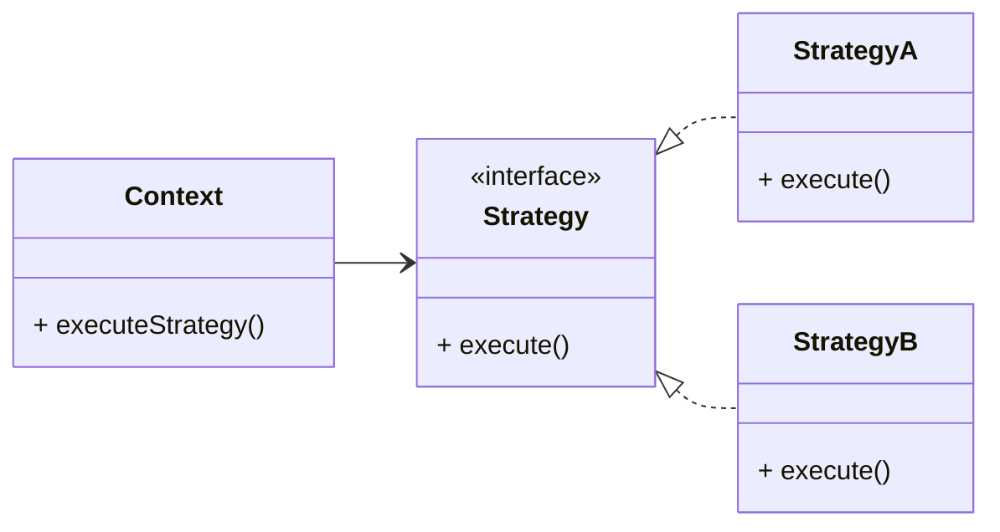
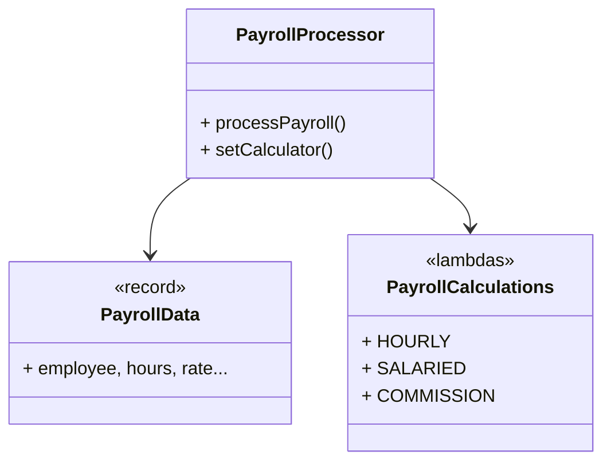
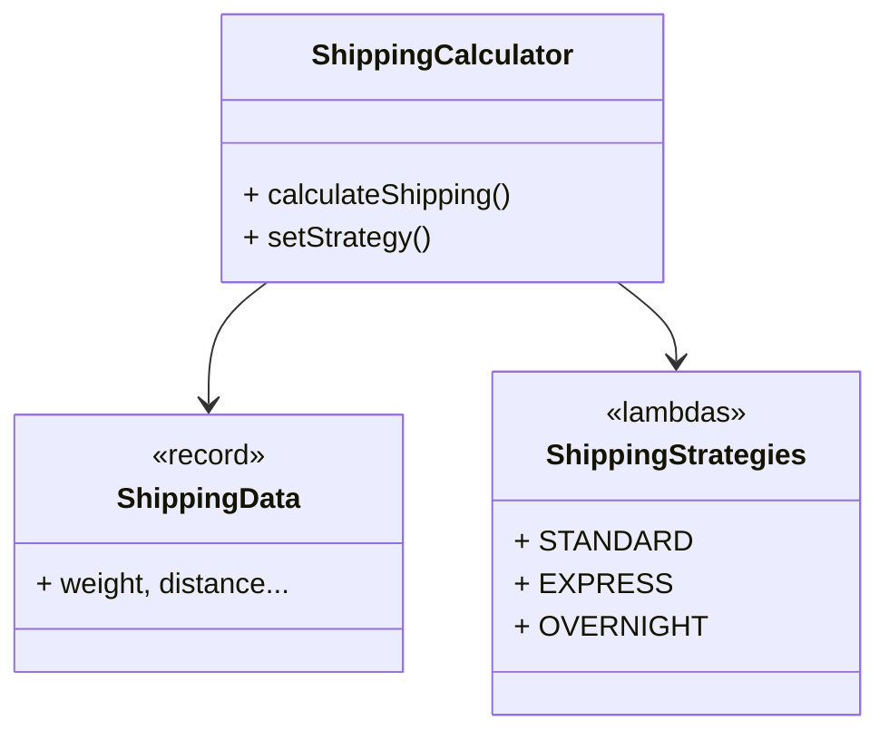

# Contact Info

Ken Kousen<br>
Kousen IT, Inc.

- ken.kousen@kousenit.com
- http://www.kousenit.com
- http://kousenit.org (blog)
- Social Media:
  - [@kenkousen](https://twitter.com/kenkousen) (Twitter)
  - [@kousenit.com](https://bsky.app/profile/kousenit.com) (Bluesky)
  - [https://www.linkedin.com/in/kenkousen/](https://www.linkedin.com/in/kenkousen/) (LinkedIn)
- *Tales from the jar side* (free newsletter)
  - https://kenkousen.substack.com
  - https://youtube.com/@talesfromthejarside

---

# Strategy: The Business Rules Pattern

<v-clicks>

- **Behavioral design pattern** - focuses on how objects interact and distribute responsibilities
- **Perfect for business rules** - handles logic that changes frequently or varies by context
- **Encapsulates complex logic** - separates decision-making into interchangeable strategies
- **Prevents code clutter** - eliminates giant `if/else` chains in main business logic
- **Key insight** - isolates complexity to make business rules easy to modify, test, and extend

</v-clicks>

---

# Traditional Strategy Pattern



---

# Modern Lambda Strategy Pattern



---

# Try It Out: Shipping Exercise



---

# Why Strategy for Business Rules?

<v-clicks>

**Common Scenario - Payroll Complexity**

<v-clicks>

- Hourly workers: overtime calculations, shift differentials
- Salaried workers: bonuses, deductions, pro-rating
- Sales staff: base + commission, tiered rates, quota bonuses
- Contractors: daily rates, weekend premiums, project bonuses

</v-clicks>

**Without Strategy** - Giant `if/else` blocks, hard to maintain
**With Strategy** - Each rule is isolated, testable, and changeable

</v-clicks>

---

# Modern Strategy Pattern (2025)

<v-clicks>

- **Traditional approach** - Interface + concrete classes
- **Modern approach** - `Function<T,R>` + lambda expressions  
- **Why lambdas excel** - Perfect for business rule logic
- **Business benefit** - Quick rule changes without touching main code

</v-clicks>

---

# Code Demo: Modern Lambda-based Strategy

**(Show `design-patterns/src/main/java/SalaryCalculator.java`)**

**1. Data Container (Record)**

```java
record PayrollData(StrategyEmployee employee, Integer hoursWorked, 
                   Double salesAmount, Double hourlyRate, 
                   Double annualSalary, Double baseSalary, 
                   Double commissionRate) {
    // Multiple constructors for different employee types
}
```

**2. Lambda-based Strategies**

```java
class PayrollCalculations {
    public static final Function<PayrollData, Double> HOURLY = data -> {
        // Calculation logic here
    };
    
    public static final Function<PayrollData, Double> SALARIED = data -> {
        return data.annualSalary() / 26; // Bi-weekly
    };
}
```

---

# Modern Context with Function Interface

**3. The Modern `Context` Class**

```java
class PayrollProcessor {
    private Function<PayrollData, Double> payCalculator;
    private String calculatorDescription;
    
    public PayrollProcessor(Function<PayrollData, Double> payCalculator, 
                           String description) {
        this.payCalculator = payCalculator;
        this.calculatorDescription = description;
    }
    
    public double processPayroll(PayrollData payrollData) {
        return payCalculator.apply(payrollData);
    }
    
    public void setCalculator(Function<PayrollData, Double> calculator, 
                             String description) {
        this.payCalculator = calculator;
        this.calculatorDescription = description;
    }
}
```

---

# Lambda Strategy Examples

<v-clicks>

**1. Using Predefined Strategies**
```java
var processor = new PayrollProcessor(PayrollCalculations.HOURLY, "Hourly");
var hourlyData = new PayrollData(employee, 45, 25.0); // 45 hours, $25/hour
processor.processPayroll(hourlyData);
```

**2. Custom Lambda Strategy**
```java
Function<PayrollData, Double> consultantStrategy = data -> {
    return data.hoursWorked() * data.hourlyRate(); // No overtime
};
processor.setCalculator(consultantStrategy, "Consultant Rate");
```

**3. Method Reference**
```java
processor.setCalculator(StrategyPatternDemo::consultantRate, "Consultant");
```

</v-clicks>

---

# Advanced Lambda Features

<v-clicks>

**Strategy Maps for Dynamic Selection**
```java
Map<String, Function<PayrollData, Double>> strategies = Map.of(
    "HOURLY", PayrollCalculations.HOURLY,
    "SALARIED", PayrollCalculations.SALARIED,
    "COMMISSION", PayrollCalculations.COMMISSION
);

Function<PayrollData, Double> selected = strategies.get("HOURLY");
```

**Custom Strategy Factory**
```java
Function<PayrollData, Double> contractorStrategy = 
    PayrollCalculations.customStrategy(
        "Contractor with daily rate",
        data -> /* complex contractor logic */
    );
```

</v-clicks>

---

# Strategy Pattern for Business Agility

<v-clicks>

- **Quick rule changes** - Modify behavior without touching core logic
- **Easy testing** - Each business rule can be tested in isolation  
- **Audit compliance** - Clear separation of calculation logic
- **A/B testing** - Switch between rule variants at runtime

</v-clicks>

<v-clicks>

- **Clean architecture** - Business rules separate from application logic
- **Open/Closed Principle** - Add new rules without modifying existing code
- **Single Responsibility** - Each strategy does one calculation well

</v-clicks>

---

# Recognizing Strategy Pattern Opportunities

<v-clicks>

- **Multiple calculation methods** - Different ways to compute the same result
- **Conditional complexity** - Long `if/else` chains based on type/status
- **Frequently changing rules** - Business logic that evolves often
- **Context-dependent behavior** - Same operation, different rules by situation

</v-clicks>

<v-clicks>

**Classic examples:**
- Pricing strategies (regular, premium, bulk, seasonal)
- Tax calculations (by region, customer type, product category)  
- Shipping costs (standard, express, international, weight-based)
- Discount rules (loyalty, volume, promotional, seasonal)

</v-clicks>