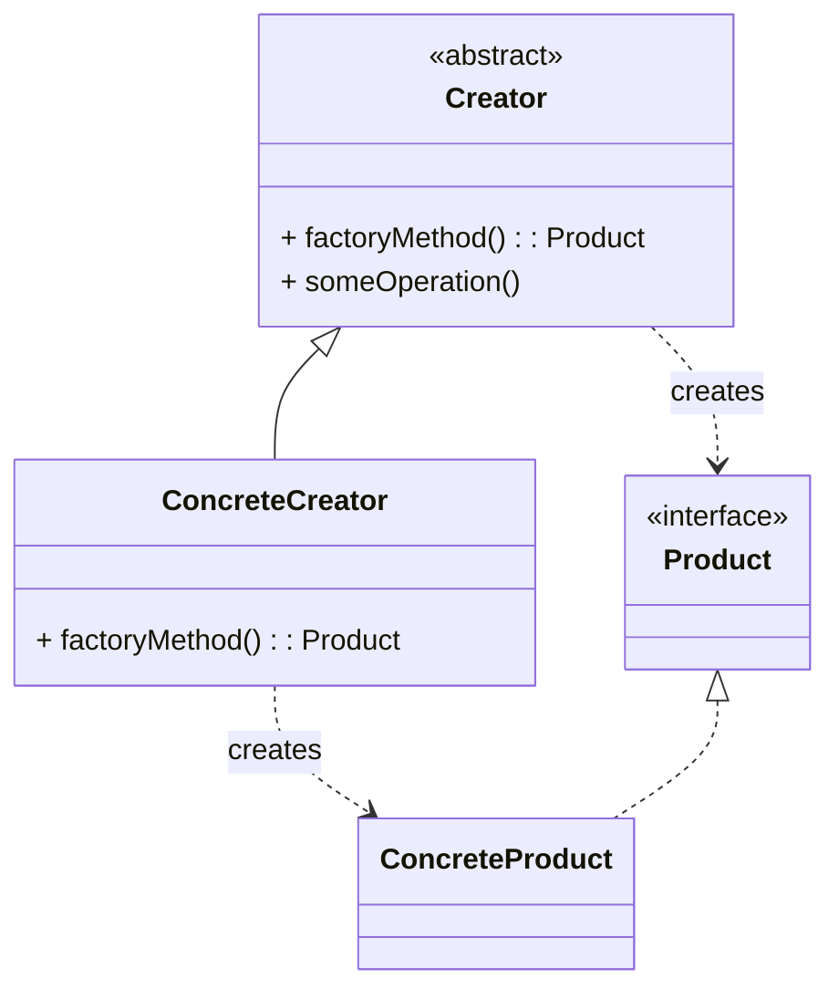

# Contact Info

Ken Kousen<br>
Kousen IT, Inc.

- ken.kousen@kousenit.com
- http://www.kousenit.com
- http://kousenit.org (blog)
- Social Media:
  - [@kenkousen](https://twitter.com/kenkousen) (Twitter)
  - [@kousenit.com](https://bsky.app/profile/kousenit.com) (Bluesky)
  - [https://www.linkedin.com/in/kenkousen/](https://www.linkedin.com/in/kenkousen/) (LinkedIn)
- *Tales from the jar side* (free newsletter)
  - https://kenkousen.substack.com
  - https://youtube.com/@talesfromthejarside

---
layout: section
---

# What is the Factory Pattern?

<v-clicks>

- A **creational** design pattern.
- It provides an interface for creating objects in a superclass, but allows subclasses to alter the type of objects that will be created.
- It decouples the client code (which needs an object) from the code that actually creates the object.
- There are two main variations: **Factory Method** and **Abstract Factory**.

</v-clicks>

<div class="mt-8">
<v-click>

**Key Idea:** Defer instantiation to subclasses.

</v-click>
</div>

---

# The Factory Method Pattern

This is the most common form of the pattern.

<v-clicks>

1.  **The `Product` Interface:** Defines the interface for the objects the factory method creates.

2.  **Concrete `Product` Classes:** Implement the `Product` interface.

3.  **The `Creator` (Factory) Class:** Declares the `factoryMethod()` that returns a `Product` object. It can also have a default implementation.

4.  **Concrete `Creator` Classes:** Override the `factoryMethod()` to return an instance of a specific `ConcreteProduct`.

</v-clicks>

---

# UML Diagram (Factory Method)



---

# Code Demo: `EmployeeFactory.java`

Let's look at a system for creating different types of `Employee` objects.

**(Show `design-patterns/src/main/java/EmployeeFactory.java`)**

**1. The `Product` (and Concrete Products):**
`Employee` is the base class, with subclasses like `Developer`, `Manager`, etc.

**2. The `Creator` (Factory):**
`EmployeeFactory` is an abstract class with a `factoryMethod` called `createEmployee`.

```java
// The abstract Creator
public abstract class EmployeeFactory {
    // The factory method
    public abstract Employee createEmployee(String name, int id, double salary);

    // A static factory to get the right factory
    public static EmployeeFactory getFactory(EmployeeType type) {
        // ... returns a DeveloperFactory, ManagerFactory, etc.
    }
}
```

---

# Code Demo: Concrete Creators

**3. The Concrete `Creator` Classes:**

Each subclass of `EmployeeFactory` overrides `createEmployee` to return a specific type of employee.

```java
// A Concrete Creator
class DeveloperFactory extends EmployeeFactory {
    @Override
    public Employee createEmployee(String name, int id, double salary) {
        return new Developer(name, id, salary);
    }
}

// Another Concrete Creator
class ManagerFactory extends EmployeeFactory {
    @Override
    public Employee createEmployee(String name, int id, double salary) {
        return new Manager(name, id, salary);
    }
}
```

---

# Using the Factory

The client code asks for a specific factory, then uses it to create employees without knowing the concrete employee class.

```java
// From FactoryPatternDemo.java

// 1. Get the appropriate factory
EmployeeFactory developerFactory = EmployeeFactory.getFactory(EmployeeType.DEVELOPER);
EmployeeFactory managerFactory = EmployeeFactory.getFactory(EmployeeType.MANAGER);

// 2. Use the factory to create an object
Employee developer = developerFactory.createEmployee("Ada Lovelace", 1, 120000);
Employee manager = managerFactory.createEmployee("Grace Hopper", 2, 150000);

// The client code doesn't know it got a `Developer` or `Manager` object.
// It only knows it got an `Employee`.
System.out.println(developer.getDetails()); // Works polymorphically
System.out.println(manager.getDetails());
```

---
layout: section
---

# Key Takeaways

<v-clicks>

- The Factory Method pattern separates object creation from object use.
- It allows you to introduce new types of products without changing the client code, adhering to the Open/Closed Principle.
- The client code works with the `Product` interface and the `Creator` class, not the concrete implementations.
- This leads to a more flexible and less coupled system.

</v-clicks>
