# Contact Info

Ken Kousen<br>
Kousen IT, Inc.

- ken.kousen@kousenit.com
- http://www.kousenit.com
- http://kousenit.org (blog)
- Social Media:
  - [@kenkousen](https://twitter.com/kenkousen) (Twitter)
  - [@kousenit.com](https://bsky.app/profile/kousenit.com) (Bluesky)
  - [https://www.linkedin.com/in/kenkousen/](https://www.linkedin.com/in/kenkousen/) (LinkedIn)
- *Tales from the jar side* (free newsletter)
  - https://kenkousen.substack.com
  - https://youtube.com/@talesfromthejarside

---
layout: section
---

# The Single Responsibility Principle

---

# What is SRP?

<v-clicks>

- The **S** in the **SOLID** acronym
- A fundamental principle of object-oriented design

</v-clicks>

---

# The SOLID Principles

<v-clicks>

- **S**ingle Responsibility Principle *(today's focus)*
- **O**pen/Closed Principle
- **L**iskov Substitution Principle  
- **I**nterface Segregation Principle
- **D**ependency Inversion Principle

</v-clicks>

<div class="text-center mt-8">
<v-click>

## A class should have **one clear responsibility**

</v-click>
</div>

---

# What SRP Means (and Doesn't Mean)

<v-click>

SRP doesn't mean your class can only have one method.

</v-click>

<v-click>

It means all methods and properties should be closely related to a **single, primary responsibility**.

</v-click>

<div class="text-center mt-8">
<v-click>

## A class should do **one thing**, and do it **well**

</v-click>
</div>

---

# Why is SRP Important?

When a class has multiple responsibilities:

<v-clicks>

- **Multiple Dependencies:** The class depends on many unrelated systems (database, email, calculations)
- **Difficult to Understand:** The class becomes a "god object" that's hard to read and maintain
- **Fragile:** A change in one responsibility can break another, unrelated responsibility
- **Hard to Test:** Difficult to write focused unit tests for classes with many behaviors

</v-clicks>

---

# Example: SRP Violation

Let's look at a single `Employee` class that handles everything:

```java
// VIOLATION of SRP
public class Employee {
    // Responsibility 1: Employee Data
    private String name;
    private double salary;

    // Responsibility 2: Database Logic
    public void saveToDatabase() {
        // ... code to connect to DB and save employee ...
    }

    // Responsibility 3: Payroll Calculation
    public double calculatePay() {
        // ... code to calculate payroll ...
    }

    // Responsibility 4: Report Generation
    public String generateReport() {
        // ... code to format a report ...
    }
}
```

---

# The Problem

<v-click>

This class has **four different responsibilities:**

</v-click>

<v-clicks>

- Database schema changes
- Payroll rule changes  
- Report format changes
- Employee data structure changes

</v-clicks>

<v-click>

Changes to any of these different concerns would all require modifying this one class.

</v-click>

---

# The Solution: Separate Responsibilities

We can refactor by separating each responsibility into its own class.

<v-click>

**Key Insight:** You often simplify difficult problems by **adding classes**. More classes with focused purposes are easier to understand than fewer classes doing too much.

</v-click>

---

# Step 1: Employee Data Only

```java
// Data only - one responsibility
public class Employee {
    private String name;
    private double salary;
    
    // getters and setters only
    public String getName() { return name; }
    public void setName(String name) { this.name = name; }
    public double getSalary() { return salary; }
    public void setSalary(double salary) { this.salary = salary; }
}
```

---

# Step 2: Database Persistence

```java
// Persistence only - one responsibility
public class EmployeeRepository {
    public void save(Employee employee) {
        // ... database connection logic ...
        // ... SQL INSERT/UPDATE statements ...
    }
    
    public Employee findById(int id) {
        // ... database query logic ...
    }
    
    public List<Employee> findAll() {
        // ... query all employees ...
    }
}
```

---

# Step 3: Payroll Calculations

```java
// Calculations only - one responsibility
public class PayrollService {
    public double calculatePay(Employee employee) {
        // ... payroll calculation logic ...
        // ... tax deductions ...
        // ... benefits calculations ...
    }
    
    public double calculateBonus(Employee employee) {
        // ... bonus calculation logic ...
    }
}
```

---

# Step 4: Report Generation

```java
// Reporting only - one responsibility
public class ReportGenerator {
    public String generate(Employee employee) {
        // ... report formatting logic ...
        // ... template processing ...
        // ... output generation ...
    }
    
    public String generateSummary(List<Employee> employees) {
        // ... summary report logic ...
    }
}
```

---

# The Result

<v-click>

Now each class has only **one clear responsibility**.

</v-click>

<v-click>

Changes to database logic don't affect payroll calculations.

</v-click>

<v-click>

Changes to report formatting don't affect data persistence.

</v-click>

---

# SRP: Before vs After

```mermaid
graph LR
    subgraph before ["❌ BEFORE: SRP Violation"]
        A["🔴 Employee Class<br/><br/>• Employee Data<br/>• Database Logic<br/>• Payroll Calculations<br/>• Report Generation<br/><br/>TOO MANY RESPONSIBILITIES!"]
    end
    
    subgraph after ["✅ AFTER: SRP Applied"]
        B["📄 Employee<br/>Data Only"]
        C["💾 EmployeeRepository<br/>Database Only"]
        D["💰 PayrollService<br/>Calculations Only"]
        E["📊 ReportGenerator<br/>Reports Only"]
        F["🎯 EmployeeService<br/>Coordination Only"]
        
        F --> B
        F --> C
        F --> D
        F --> E
    end
    
    A -.-> |"REFACTOR<br/>USING SRP"| F
    
    style A fill:#ffebee,stroke:#d32f2f,color:#000
    style F fill:#e8f5e8,stroke:#4caf50,color:#000
    style B fill:#e3f2fd,stroke:#2196f3,color:#000
    style C fill:#e3f2fd,stroke:#2196f3,color:#000
    style D fill:#e3f2fd,stroke:#2196f3,color:#000
    style E fill:#e3f2fd,stroke:#2196f3,color:#000
```

<div class="flex justify-center mt-16" style="transform: scale(1.6);">



</div>

---

# Code Demo: Our SRP Implementation

File: `solid-principles/src/main/java/SRPEmployeeService.java`

<v-click>

This demonstrates proper separation of concerns with dependency injection.

</v-click>

---

# The SRPEmployee Class

```java
// Data only - single responsibility
class SRPEmployee {
    private final int id;
    private String name;
    private String email;
    private double salary;
    private final LocalDate hireDate;
    private String department;
    
    // Constructor and getters/setters only
    public SRPEmployee(int id, String name, String email, 
                      double salary, LocalDate hireDate) {
        this.id = id;
        this.name = name;
        this.email = email;
        this.salary = salary;
        this.hireDate = hireDate;
    }
}
```

---

# The Service Interfaces

```java
// Persistence only - single responsibility
interface EmployeeRepository {
    void save(SRPEmployee employee);
    SRPEmployee findById(int id);
    List<SRPEmployee> findAll();
    void delete(int id);
}

// Calculations only - single responsibility
interface SalaryCalculator {
    double calculateAnnualSalary(SRPEmployee employee);
    double calculateMonthlyPay(SRPEmployee employee);
    double calculateBonus(SRPEmployee employee);
}
```

---

# The Notification Interface

```java
// Notifications only - single responsibility
interface NotificationService {
    void sendWelcomeEmail(SRPEmployee employee);
    
    void sendSalaryChangeNotification(SRPEmployee employee, 
                                     double oldSalary, 
                                     double newSalary);
                                     
    void sendTerminationNotification(SRPEmployee employee);
}
```

---

# The Coordinator Service

```java
// Business logic coordination - single responsibility
public class SRPEmployeeService {
    private final EmployeeRepository repository;
    private final SalaryCalculator salaryCalculator;
    private final NotificationService notificationService;
    
    // Dependency Injection Constructor
    public SRPEmployeeService(EmployeeRepository repository, 
                             SalaryCalculator salaryCalculator, 
                             NotificationService notificationService) {
        this.repository = repository;
        this.salaryCalculator = salaryCalculator;
        this.notificationService = notificationService;
    }
}
```

---

# Business Logic Methods

```java
public void hireEmployee(SRPEmployee employee) {
    repository.save(employee);
    notificationService.sendWelcomeEmail(employee);
}

public void updateSalary(int employeeId, double newSalary) {
    SRPEmployee employee = repository.findById(employeeId);
    if (employee != null) {
        double oldSalary = employee.getSalary();
        employee.setSalary(newSalary);
        repository.save(employee);
        notificationService.sendSalaryChangeNotification(
            employee, oldSalary, newSalary);
    }
}
```

<v-click>

Notice: No database code, no email code, no salary calculation code.
Just **coordination** of specialized services.

</v-click>

---

# Benefits of This Approach

<v-clicks>

- **Easy to test** each component in isolation
- **Changes to notification logic** don't affect salary calculations
- **Database changes** don't affect business logic
- **New features** can be added without modifying existing classes
- **Smaller, focused classes** that are easier to understand and maintain

</v-clicks>

---
layout: section
---

# Key Takeaways

---

# Remember These Points

<v-clicks>

- **SRP is fundamental** for writing clean, maintainable code
- **A class should have one clear responsibility**
- **Following SRP leads to** smaller, focused, testable classes
- **It reduces coupling** and makes your system more resilient to change

</v-clicks>

<div class="text-center mt-12">
<v-click>

## Questions about the Single Responsibility Principle?

</v-click>
</div>