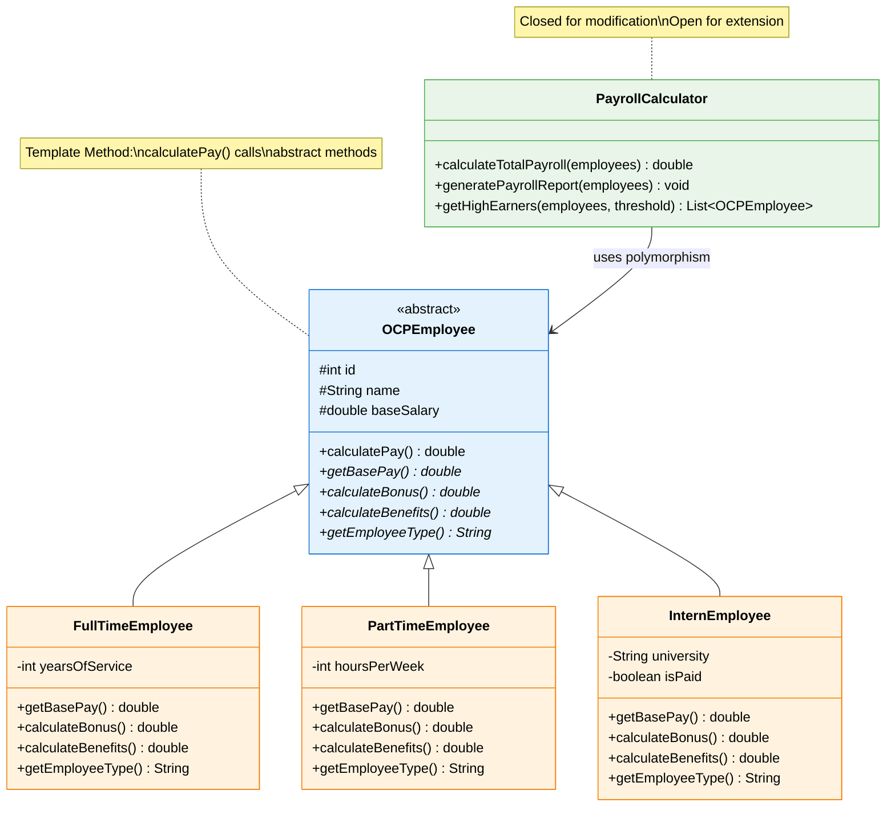

# Contact Info

Ken Kousen<br>
Kousen IT, Inc.

- ken.kousen@kousenit.com
- http://www.kousenit.com
- http://kousenit.org (blog)
- Social Media:
  - [@kenkousen](https://twitter.com/kenkousen) (Twitter)
  - [@kousenit.com](https://bsky.app/profile/kousenit.com) (Bluesky)
  - [https://www.linkedin.com/in/kenkousen/](https://www.linkedin.com/in/kenkousen/) (LinkedIn)
- *Tales from the jar side* (free newsletter)
  - https://kenkousen.substack.com
  - https://youtube.com/@talesfromthejarside

---
layout: section
---

# The Open/Closed Principle

---

# What is OCP?

<v-clicks>

- The **O** in the **SOLID** acronym
- First described by Bertrand Meyer
- Software entities should be **open for extension, but closed for modification**

</v-clicks>

---

# OCP Definition

<v-click>

**Open for Extension:** You can add new functionality

</v-click>

<v-click>

**Closed for Modification:** You don't change existing, tested code

</v-click>

<div class="text-center mt-12">
<v-click>

## Key Insight: Use abstraction to allow new functionality to be plugged in

</v-click>
</div>

---

# Why is OCP Important?

When you modify existing, working code, you risk:

<v-clicks>

- **Introducing bugs** - Breaking something that was previously working
- **Increased testing effort** - The entire class needs to be re-tested
- **Cascading changes** - Forcing changes in dependent classes

</v-clicks>

<v-click>

By extending instead of modifying, you minimize these risks.

</v-click>

---

# Example: OCP Violation

A `ShapeAreaCalculator` with if-else chains:

```java
// VIOLATION of OCP
public class ShapeAreaCalculator {
    public double calculateArea(Object shape) {
        double area = 0;
        if (shape instanceof Rectangle) {
            Rectangle r = (Rectangle) shape;
            area = r.getWidth() * r.getHeight();
        } else if (shape instanceof Circle) {
            Circle c = (Circle) shape;
            area = Math.PI * c.getRadius() * c.getRadius();
        }
        // What happens when we need Triangle?
        // We have to MODIFY this method!
        return area;
    }
}
```

---

# The Problem

<v-click>

This class is **not closed for modification**.

</v-click>

<v-clicks>

- Every new shape requires changing this method
- Risk of breaking existing shape calculations
- Entire class needs re-testing
- Violates the Open/Closed Principle

</v-clicks>

---

# Solution: Use Abstraction

Create a `Shape` interface:

```java
public interface Shape {
    double getArea();
}
```

<v-click>

Each shape implements the interface:

```java
public class Rectangle implements Shape {
    @Override 
    public double getArea() { 
        return width * height; 
    }
}

public class Circle implements Shape {
    @Override 
    public double getArea() { 
        return Math.PI * radius * radius; 
    }
}
```

</v-click>

---

# OCP-Compliant Calculator

```java
// OCP-Compliant
public class AreaCalculator {
    public double calculateArea(Shape shape) {
        return shape.getArea();
    }
}
```

<v-clicks>

- Simple and elegant
- Closed for modification
- Open for extension with new shapes
- Adding `Triangle` requires zero changes to this class

</v-clicks>

---

# Code Demo: Employee Payroll System

File: `solid-principles/src/main/java/OpenClosedPrinciple.java`

<v-click>

This demonstrates OCP with an employee management system using the Template Method pattern.

</v-click>

---

# The OCPEmployee Abstract Class

```java
abstract class OCPEmployee {
    protected final int id;
    protected final String name;
    protected final double baseSalary;
    
    // Template method - uses abstract methods
    public final double calculatePay() {
        double pay = getBasePay();
        pay += calculateBonus();
        pay += calculateBenefits();
        return pay;
    }
    
    // Abstract methods - subclasses implement
    protected abstract double getBasePay();
    protected abstract double calculateBonus();
    protected abstract double calculateBenefits();
}
```

---

# Concrete Implementation: FullTimeEmployee

```java
class FullTimeEmployee extends OCPEmployee {
    private final int yearsOfService;
    
    @Override
    protected double getBasePay() {
        return baseSalary;
    }
    
    @Override
    protected double calculateBonus() {
        return baseSalary * (yearsOfService * 0.01); // 1% per year
    }
    
    @Override
    protected double calculateBenefits() {
        return baseSalary * 0.15; // 15% of salary
    }
}
```

---

# Adding New Types: InternEmployee

```java
// NEW - added without modifying existing code
class InternEmployee extends OCPEmployee {
    private final boolean isPaid;
    
    @Override
    protected double getBasePay() {
        return isPaid ? baseSalary : 0;
    }
    
    @Override
    protected double calculateBonus() {
        return isPaid ? baseSalary * 0.1 : 0;
    }
    
    @Override
    protected double calculateBenefits() {
        return 1000; // Fixed benefit for experience
    }
}
```

<v-click>

**No existing classes needed modification!**

</v-click>

---

# PayrollCalculator: Closed for Modification

```java
class PayrollCalculator {
    public double calculateTotalPayroll(List<OCPEmployee> employees) {
        return employees.stream()
                .mapToDouble(OCPEmployee::calculatePay)
                .sum();
    }
    
    public void generatePayrollReport(List<OCPEmployee> employees) {
        for (OCPEmployee emp : employees) {
            System.out.println(emp); // Polymorphism in action
        }
    }
}
```

<v-click>

**Works with any employee type - past, present, or future!**

</v-click>

---

# Template Method Pattern: OCP in Action

<div class="flex justify-center mt-8" style="transform: scale(1.4); margin-top: 3rem;">



</div>

---

# Benefits of OCP

<v-clicks>

- **Reduced risk** when adding new functionality
- **Existing code remains stable** and doesn't need re-testing
- **Easier to maintain** - changes are isolated to new classes
- **More modular design** - clear separation of concerns
- **Supports polymorphism** - code works with abstractions

</v-clicks>

---

# Common Ways to Implement OCP

<v-clicks>

- **Strategy Pattern** - Interface with multiple implementations (our discount exercise)
- **Template Method Pattern** - Abstract class with concrete subclasses (our employee demo)
- **Factory Pattern** - Centralized object creation with extensible types
- **Observer Pattern** - Event listeners that can be added without modification
- **Command Pattern** - Encapsulated operations that can be extended
- **Decorator Pattern** - Wrapping objects to add behavior

</v-clicks>

---

# Modern Java OCP Approaches

<v-clicks>

- **Functional Interfaces** - Using `Function<T,R>`, `Predicate<T>`, etc.
- **ServiceLoader** - Plugin architecture for runtime discovery
- **Annotation-Based** - Framework-driven extension points (Spring, etc.)

</v-clicks>

<div class="mt-8">
<v-click>

```java
// Functional approach example
Function<Order, BigDecimal> discount = order -> 
    order.getTotal().multiply(BigDecimal.valueOf(0.10));

public BigDecimal applyDiscount(Order order, Function<Order, BigDecimal> discountFn) {
    return discountFn.apply(order); // Open for extension!
}
```

</v-click>
</div>

---
layout: section
---

# Key Takeaways

---

# Remember These Points

<v-clicks>

- **OCP is fundamental** for creating robust, maintainable systems
- **Open for extension, closed for modification**
- **Use abstraction** - interfaces and abstract classes enable this
- **Template Method pattern** is a powerful way to implement OCP
- **Polymorphism** allows existing code to work with new types

</v-clicks>

<div class="text-center mt-12">
<v-click>

## Questions about the Open/Closed Principle?

</v-click>
</div>