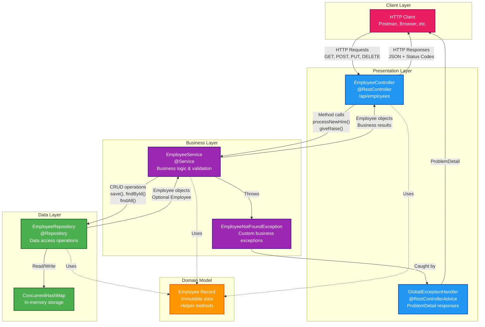

# REST API Three-Layered Architecture

## Architecture Overview

This diagram shows our clean three-layered architecture for the Employee REST API in the web-services module.

## Key Architectural Principles

### 1. **Separation of Concerns**
- **Controller Layer**: HTTP/REST concerns only
- **Service Layer**: Business logic and validation
- **Repository Layer**: Data access operations

### 2. **Dependency Direction**
- Controllers depend on Services
- Services depend on Repositories
- No upward dependencies (Repository doesn't know about Service)

### 3. **Modern Java Features**
- **Records**: Immutable data with helper methods (`withId()`, `withSalary()`)
- **Constructor Injection**: Clean dependency injection pattern
- **Business Constants**: Centralized in service layer

### 4. **Exception Handling**
- **Custom Exceptions**: `EmployeeNotFoundException` for business errors
- **Global Handler**: `@RestControllerAdvice` with `ProblemDetail` (RFC 7807)
- **Proper HTTP Status**: 404 for not found, 400 for validation errors

### 5. **Testing Strategy**
- **Repository**: Pure unit tests (no Spring context)
- **Service**: Spring Boot integration tests with `@MockitoBean`
- **Controller**: Web layer tests with `@WebMvcTest` and `MockMvc`

## Business Operations

Our service layer includes sophisticated business operations beyond simple CRUD:

- `processNewHire()` - Salary validation and employee creation
- `giveRaise()` - Salary increase with business rules
- `giveStandardRaise()` - Standard 5% salary increase
- `transferEmployee()` - Department transfer with validation
- `findHighPerformers()` - Query employees above performance threshold
- `calculateDepartmentSalaryExpense()` - Business reporting

## Data Flow Example

1. **Client** sends `POST /api/employees` with JSON
2. **Controller** validates request, calls `employeeService.processNewHire()`
3. **Service** validates business rules (salary range), calls `repository.save()`
4. **Repository** generates ID, stores in `ConcurrentHashMap`
5. **Response** flows back through layers with proper HTTP status

This architecture ensures maintainability, testability, and clear separation of responsibilities.